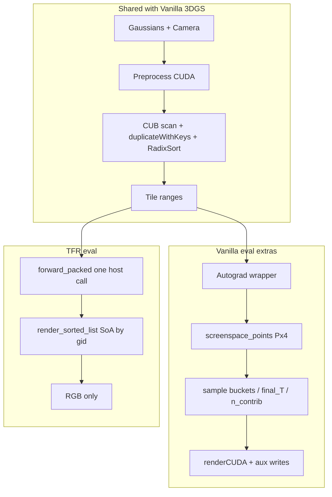

# Vanilla 3DGS vs TFR：差异与加速机制说明

> 面向论文审稿 / 方法章节的书面版说明。配套图：
>
> - [`outputs/figures/fig_vs_vanilla_3dgs.pdf`](../outputs/figures/fig_vs_vanilla_3dgs.pdf) — 并排差异总览
> - [`outputs/figures/fig_mechanism_speedup.pdf`](../outputs/figures/fig_mechanism_speedup.pdf) — 加速杠杆细节
> - [`outputs/figures/fig_mechanism_speedup_compact.pdf`](../outputs/figures/fig_mechanism_speedup_compact.pdf) — 单栏紧凑版
>
> 生成脚本：`scripts/make_vs_3dgs_figure.py`、`scripts/make_mechanism_figure.py`。

---

## 1. 一句话结论

**TFR 不改变 3DGS 的图像形成模型**（仍是 16×16 tile + 深度排序 + α compositing），而是把 **评测/推理（eval）** 做成一条 **GPU 融合、forward-only** 的路径：去掉 Autograd / densify 脚手架、去掉训练用 sample-bucket 写入、去掉 `gather_pack` 属性重写，从而在 **iteration_30000 PLY**、全 test 相机上得到约 **2.2–2.4×** 端到端 FPS 提升，且相对 native 渲染结果 PSNR ≈ **99 dB**（近乎逐像素一致）。

TFR 的**产品定位是验证子模块**（`HST-GS/submodules/tfr`），**不接入 `train.py`**。训练始终走原生 `diff-gaussian-rasterization`。

---

## 2. 相同之处：共享算法骨架

下列步骤与 Kerbl et al. 原版 3DGS / HST-GS 的 CUDA rasterizer **语义一致**：

```
Gaussians (means, scales, rots, opacity, SH)
        + Camera (view / proj / FoV / campos)
                │
                ▼
        Preprocess (CUDA)
          · 投影 → means2D, depths
          · 协方差 → conic_opacity
          · SH → RGB
          · radii / visibility
                │
                ▼
        Tile binning
          · tiles_touched
          · CUB InclusiveSum → point_offsets
          · duplicateWithKeys（tile ⊕ depth 打包成 64-bit key）
          · CUB DeviceRadixSort
          · identifyTileRanges → ranges[tile] = [begin, end)
                │
                ▼
        Per-tile depth-ordered compositing
          · 每个 16×16 tile 一个 CUDA block
          · 按 sorted point_list 从前到后 α 混合
          · 输出 RGB（+ 背景）
```

**审稿人 takeaway：** TFR 不是新的 splatting 公式，也不是换了一种 tile 划分；它复用同一套 tile+深度排序合成，保证与 native 画质可对齐。

对应图：`fig_vs_vanilla_3dgs` panel **(a)**。

---

## 3. 不同之处：评测调用路径

### 3.1 Vanilla 3DGS（HST-GS `gaussian_renderer.render`）

典型调用链：

1. Python 组装 `GaussianRasterizationSettings` / `GaussianRasterizer`
2. 分配 `screenspace_points (P×4)`（`requires_grad=True`，供 densify 读 2D 梯度）
3. 进入 `_RasterizeGaussians` Autograd Function
4. CUDA forward 写出 **opaque 状态块**：
   - `geomBuffer`（means2D, depths, cov3D, conic, rgb, radii, …）
   - `binningBuffer`（sorted keys / point_list）
   - `imgBuffer`（ranges, final_T, n_contrib, …）
   - `sampleBuffer`（`sampled_T` / `sampled_ar` / `bucket_to_tile` —— **训练 backward 用**）
5. `renderCUDA`（或等价内核）合成颜色，并写训练辅助量

即便在 `torch.no_grad()` 下做评测，这条路径仍携带大量 **训练时代价**（Autograd 包装、多缓冲分配、sample-bucket 写入等），因为训练与评测共用同一套 rasterizer 模块。

### 3.2 TFR（eval / `tfr.render` / `--use_tfr`）

典型调用链：

1. **一次** host 调用：从 `Camera` + `GaussianModel` 解包张量
2. `tfr_cuda.forward_packed`（或等价融合入口）：
   - preprocess → CUB binning → `identifyTileRanges`
   - `render_sorted_list`：block/tile 直接按 `point_list[i] → SoA[gid]` 取属性
3. **默认不写**：`final_T` / `n_contrib` / sample buckets（color-only）
4. **默认 `with_aux=False`**：不分配 densify 用的 `P×4` screenspace 张量
5. 返回 `{"render", "radii", ...}`；无 Autograd

对应图：`fig_vs_vanilla_3dgs` panel **(b)**。

---

## 4. 具体差异对照表

| 维度 | Vanilla 3DGS（HST-GS） | TFR（eval） |
|------|----------------------|--------------|
| **入口 API** | `GaussianRasterizer` / `_C.rasterize_gaussians` | `tfr.render` → `tfr_cuda.forward_packed` |
| **设计目标** | 训练 + 评测一体 | **仅验证 / FPS / 画质对比**（forward-only） |
| **Grad / densify** | `screenspace_points (P×4)` + retain_grad | 默认不建；`with_aux=False` |
| **Autograd** | `_RasterizeGaussians.apply` | eval 路径无 Autograd Function |
| **Sort / binning** | CUB InclusiveSum + RadixSort + tile ranges | **同一套 CUB 配方** |
| **Raster 取数** | `point_list` + per-Gaussian attrs；训练路径常带 sample buckets | `point_list → SoA[gid]`；**跳过 gather_pack 重写** |
| **训练辅助缓冲** | `final_T`, `n_contrib`, `sampled_T/ar`, `bucket_to_tile`, … | eval：**只写 RGB** |
| **Host 编排** | Python settings + 多步扩展调用 | **单次融合 CUDA 调用** |
| **HST-GS 接线** | 默认路径 | `pipe.use_tfr` / `HSTGS_USE_TFR=1`；**禁止用于 train** |
| **不支持标志** | 完整 pipe 能力 | `separate_sh` / `override_color` / Python SH·cov → 显式报错 |

对应图：`fig_vs_vanilla_3dgs` panel **(c)**。

---

## 5. 为什么更快：三条加速杠杆

对应图：`fig_mechanism_speedup` / compact，以及 `fig_vs_vanilla_3dgs` panel **(d)**。

### 杠杆 1 — 消除 Host / Autograd 税

| 非融合 / Vanilla 评测路径常见开销 | TFR eval |
|----------------------------------|-----------|
| 多次 Python↔CUDA 边界跨越 | 一次 `forward_packed` |
| 围绕 `torch.argsort` 的 sync | 设备内 CUB radix sort，全程常驻 GPU |
| 每帧分配 densify / Autograd 脚手架 | 不分配 |

测速时报告的是 **端到端 FPS**（preprocess + binning + raster），中间不加额外 `cuda.synchronize` 分段。

### 杠杆 2 — 设备内 CUB 排序与 binning

- Key：`(tile_id << 24) | (depth_bits)`（24-bit depth + tile）
- `cub::DeviceScan::InclusiveSum` → instance 数前缀和
- `cub::DeviceRadixSort::SortPairs`（bit 宽 ≈ `24 + msb(num_tiles)`）
- `identifyTileRanges` → 每 tile 的 `[begin, end)`

相对「Python 侧拼 tile list + PyTorch argsort」更稳、更少 D2H/H2D。

### 杠杆 3 — 按索引直接光栅，去掉 gather_pack

早期 TFR / 部分实验路径会把每个 tile 的 Gaussian 属性 **gather** 成连续 packed 缓冲再 raster。  
当前 eval 路径：

- 排序后只保留 `point_list`（Gaussian id）与 `ranges`
- 每个 tile block 用 `gid = point_list[k]` 直接读 `means2d[gid]` / `conic_opacity[gid]` / `rgb[gid]`

省掉 **\(L \times\)(xy, conic, rgb)** 的整表重写带宽；\(L\) 为 duplicate 后的实例数，大场景下很可观。

### 不变的部分（解释“为何 PSNR≈99 dB”）

- 16×16 tile
- 同一深度序
- 同一 α compositing / 截断规则（与 golden 对齐的 preprocess + raster）

因此相对 **native 输出**（不是相对 GT）的 PSNR 通常饱和在 ~99 dB。

---

## 6. 数据流示意（文字版）



---

## 7. 定量结果（eval，iteration_30000 PLY）

协议：`scripts/bench_tfr_render.py --all-13`，**每个场景全部 test 相机**，warmup=2，repeats=5。  
指标：Native FPS / TFR e2e FPS / Speedup = TFR_FPS÷Native_FPS / PSNR vs native。

| Scene | Native FPS | TFR FPS | Speedup | PSNR vs native |
|-------|-----------:|---------:|--------:|---------------:|
| bicycle | ~105 | ~231 | ~2.19× | 99.0 |
| flowers | ~161 | ~387 | ~2.40× | 99.0 |
| garden | ~123 | ~271 | ~2.21× | 99.0 |
| stump | ~132 | ~326 | ~2.46× | 99.0 |
| treehill | ~140 | ~331 | ~2.36× | 99.0 |
| room | ~213 | ~475 | ~2.23× | ~98 |
| counter | ~206 | ~443 | ~2.15× | 99.0 |
| kitchen | ~181 | ~389 | ~2.15× | ~98 |
| bonsai | ~236 | ~560 | ~2.37× | 99.0 |
| playroom | ~210 | ~517 | ~2.46× | ~98 |
| drjohnson | ~161 | ~385 | ~2.38× | 99.0 |
| Truck | ~177 | ~410 | ~2.31× | 99.0 |
| Train | ~203 | ~436 | ~2.14× | ~98 |
| **Mean** | **~175** | **~407** | **~2.32×** | **~98.7** |

原始 JSON：`outputs/bench_render/bench_render_13.json`。  
结果图：`fig2_fps_bars` / `fig3_speedup` / `fig4_quality_psnr` / `fig5_mem_saving` / `fig6_fps_scatter`。

---

## 8. 与“训练接入”的关系（避免审稿误解）

仓库内曾做过 Phase 1/2 Autograd（classic reverse-α → PerGaussian sample-bucket）研究，梯度可与 HST-GS 对齐，短训/中训画质可比。

**当前正式姿态：**

- TFR = **eval-only 子模块**
- `train.py --use_tfr` / 训练期 `HSTGS_USE_TFR=1` → **直接报错退出**
- 论文主结果应报告 **验证加速 + 与 native 的一致性**，而不是“用 TFR 替代训练 rasterizer”

详见 [`experiments.md`](experiments.md)、[`HST-GS/submodules/TFR.md`](../../HST-GS/submodules/TFR.md)。

---

## 9. 实现文件地图（便于复现）

| 组件 | 路径 |
|------|------|
| 融合 forward + CUB binning | `cuda/csrc/tfr_binning.cu` |
| sorted-list raster（及 train 研究路径） | `cuda/csrc/tfr_render.cu` |
| preprocess | `cuda/csrc/tfr_preprocess.cu` |
| Python 入口 | `python/tfr/render.py` → `render()` / `render_from_gaussians()` |
| HST-GS 开关 | `HST-GS/gaussian_renderer/__init__.py`（`use_tfr` / `HSTGS_USE_TFR`） |
| 13-scene FPS bench | `scripts/bench_tfr_render.py` |
| 对比图 | `scripts/make_vs_3dgs_figure.py` |
| 机制图 | `scripts/make_mechanism_figure.py` |

---

## 10. 写作时可用的短表述（可直接进论文）

**Method.** TFR keeps the standard 3DGS 16×16 tile rasterization pipeline (preprocess, CUB key duplication and radix sort, per-tile front-to-back α-blending) but specializes the **evaluation** path: a single fused CUDA forward without Autograd scaffolding, without training sample-bucket traffic, and without a gather-pack attribute rewrite—fetching Gaussian attributes by sorted index into SoA buffers.

**Claim.** On Kerbl-style checkpoints at 30k iterations, TFR improves end-to-end validation FPS by approximately **2.3×** on average across 13 scenes while matching the native renderer to **~99 dB** PSNR, confirming that the speedup comes from systems specialization rather than a change of the image formation model.
